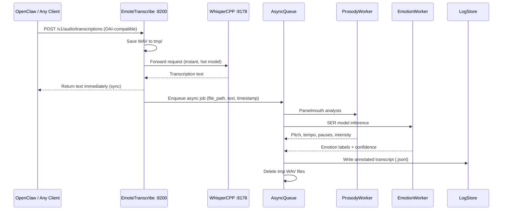

# Emote-Transcribe v2 Architecture

## Overview

Two-tier system: fast synchronous transcription layer (Whisper proxy) + async prosody/emotion enrichment. Results merged into annotated transcript logs. Everything cleanable, switchable, OpenAI API-compatible.

## Architecture




## Endpoint Design (OpenAI-compatible)

The proxy mimics OpenAI's `/v1/audio/transcriptions` so OpenClaw and any OpenAI-compatible client can use it as a drop-in replacement:

```
POST /v1/audio/transcriptions
Content-Type: multipart/form-data

file: <audio>
model: "whisper-large-v3-turbo"   (passed through)
language: "ru"                     (passed through)
response_format: "text" | "json" | "verbose_json"
```

Response matches OpenAI format exactly. Async enrichment happens in background -- client gets instant response.

Additional endpoints:

- `GET /health` -- service status + mode
- `GET /v1/analysis/{job_id}` -- fetch async enrichment result (if ready)
- `GET /v1/analysis/latest` -- last N enriched transcripts
- `POST /v1/mode` -- switch mode: `full` | `whisper_only` | `prosody_only`
- `GET /v1/logs` -- browse annotated transcript logs

## Three SER Models (switchable via config)

All three installed, only one loaded at a time. Switch via config or API.


| Model                  | ID            | Size    | RAM     | Speed  | Accuracy | When to use                   |
| ---------------------- | ------------- | ------- | ------- | ------ | -------- | ----------------------------- |
| SpeechBrain ECAPA-TDNN | `ecapa`       | ~20 MB  | ~200 MB | <20ms  | 60-70%   | Default, always-on            |
| wav2vec2-small emotion | `wav2vec2`    | ~120 MB | ~500 MB | ~50ms  | 65-75%   | Better accuracy needed        |
| emotion2vec+ base      | `emotion2vec` | ~350 MB | ~1.2 GB | ~100ms | 70-80%   | Best accuracy, occasional use |


## Modes

- `**full**` (default) -- Whisper + Prosody + Emotion async
- `**whisper_only**` -- Pure proxy to Whisper, no async jobs, emotion model unloaded from RAM
- `**prosody_only**` -- Whisper + Parselmouth (no emotion model loaded)

Mode switch unloads/loads models from memory. No restart needed.

## Annotated Transcript Log Format

Stored in `logs/transcripts/YYYY-MM-DD.jsonl`, one JSON line per voice message:

```json
{
  "id": "uuid",
  "timestamp": "2026-02-09T16:30:00Z",
  "audio_duration_sec": 5.2,
  "text": "Привет! Как дела? ... ну ладно",
  "mode": "full",
  "prosody": {
    "global": { "speech_rate": "fast", "avg_pitch_hz": 185 },
    "segments": [
      {
        "start": 0.0, "end": 1.8,
        "text_approx": "Привет! Как дела?",
        "pitch_trend": "rising", "tempo": "fast",
        "intensity": "loud", "pause_after_ms": 800,
        "emotion": "happy", "emotion_confidence": 0.82,
        "description": "speaking fast, voice rising, loud, excited"
      }
    ]
  },
  "voice_context": "[voice analysis]\nOverall: fast pace...\n[/voice analysis]",
  "enrichment_time_ms": 340
}
```

## Cleanup Strategy

- tmp WAV files deleted immediately after async processing completes
- Transcript logs rotated: keep last 30 days by default (configurable)
- Old logs auto-deleted by background task (daily check)

## File Structure

```
emote-transcribe/
  server.py           # FastAPI app: OAI-compatible proxy + async queue
  analyzer.py         # Parselmouth prosody analysis (exists, update)
  describer.py        # Human-readable descriptions (exists, keep)
  emotion.py          # NEW: SER model wrapper (3 models, hot-swap)
  worker.py           # NEW: Async enrichment worker
  cleanup.py          # NEW: File cleanup + log rotation
  config.py           # NEW: Service config (mode, model, paths)
  requirements.txt    # Update: add speechbrain, torchaudio
  CLAUDE.md           # Update with new architecture
  README.md           # Update
```

## STT Backend (switchable)

Proxy can forward to **local Whisper** or **OpenAI API** -- configurable per request or globally:


| Backend            | ID       | Latency | Cost       | When to use                                   |
| ------------------ | -------- | ------- | ---------- | --------------------------------------------- |
| Local whisper-cpp  | `local`  | ~1-3s   | Free       | Default, always-on                            |
| OpenAI Whisper API | `openai` | ~2-5s   | $0.006/min | Whisper server down, or better quality needed |


Request-level override via header: `X-STT-Backend: openai` or query param `?backend=openai`.

If local Whisper is unreachable, auto-fallback to OpenAI (if key configured).

## Config (`config.py` + env vars)

```python
WHISPER_URL = "http://127.0.0.1:8178"     # Local whisper-cpp
OPENAI_API_KEY = ""                        # For OpenAI fallback/forward
OPENAI_WHISPER_MODEL = "whisper-1"         # OpenAI model name
STT_BACKEND = "local"                      # local | openai | auto (auto = local with openai fallback)
PORT = 8200
MODE = "full"                              # full | whisper_only | prosody_only
EMOTION_MODEL = "ecapa"                    # ecapa | wav2vec2 | emotion2vec
LOG_DIR = "logs/transcripts"
TMP_DIR = "tmp"
LOG_RETENTION_DAYS = 30
```

## Key Design Decisions

- **OpenAI-compatible endpoint** -- drop-in replacement, OpenClaw just changes baseUrl from whisper-cpp to emote-transcribe
- **Switchable STT backend** -- local whisper-cpp (free, fast) or forward to OpenAI API (paid, no local load); auto mode falls back to OpenAI if local is down
- **Sync transcription, async enrichment** -- zero added latency for the user
- **Model hot-swap** -- switch SER model without restart, unload from RAM when not needed
- **JSONL logs** -- append-only, easy to grep/parse, one file per day
- **Cleanup built-in** -- no manual WAV cleanup needed
- **Three tiers of emotion models** -- start light (ECAPA, 200MB RAM), scale up if needed

